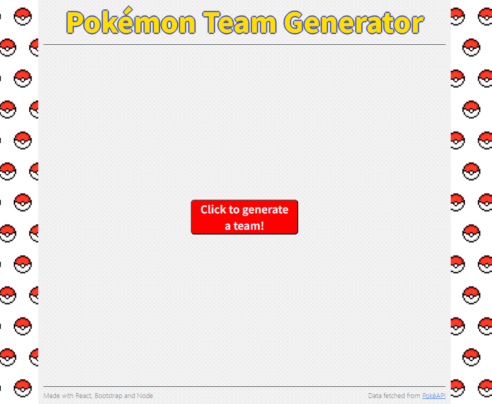
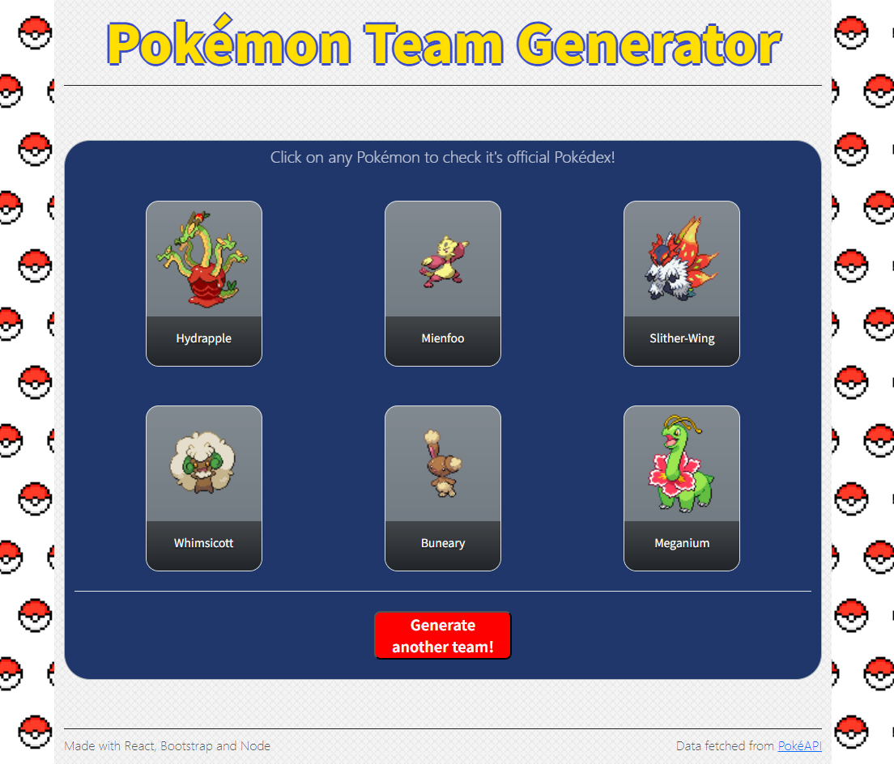

# Pokémon Team Generator
### A web application for generating a random pokémon team for your next adventure!
### Technologies used:
- **[Bootstrap](https://getbootstrap.com/)** to style and design the site.
- **[React](https://react.dev/)** to fetch data coming from the backend and exposing it to the user.
- **[Node.js](https://nodejs.org/)** and **[Express](https://www.npmjs.com/package/express)** to set the routes and the application logic at the back-end.
- **[Axios](https://www.npmjs.com/package/axios)** for handling requests to the **[PokéAPI](https://pokeapi.co/)**.
- **[NodeCache](https://www.npmjs.com/package/node-cache)** to cache the data received from the API, reducing the number of requests.

### Skills practiced:
- Front-end design and responsiveness.
- Complete full-stack web application flow.
- API understanding and requests manipulation.
- Caching data logic.

### Homepage:


### After generating a new team:


### If you want to run this application, you need to install [Node.js](https://nodejs.org/).
- After cloning this repository, run ```npm i``` inside the **root** directory to install dependencies.
- Then run ```npm i``` again inside both **frontend** and **backend** directories to install their dependencies.
- Go back to the **root** directory and run ```npm run dev```.

### This application will eventually be hosted in a cloud service!